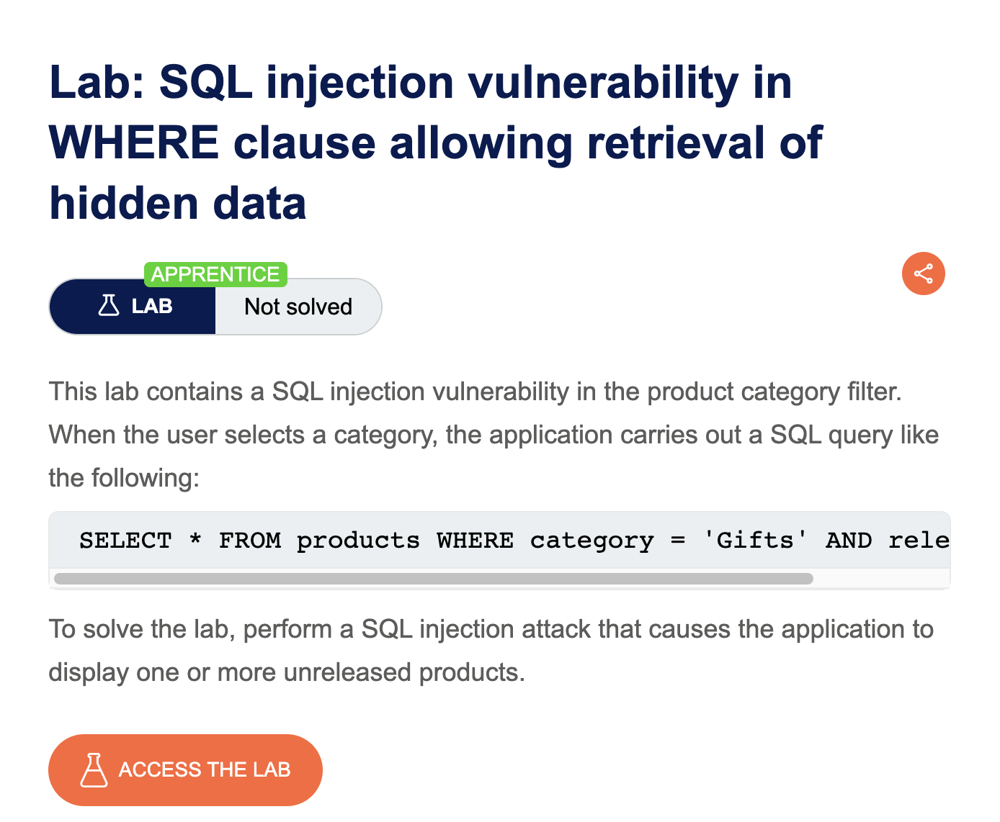
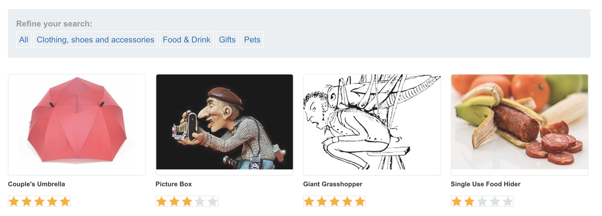
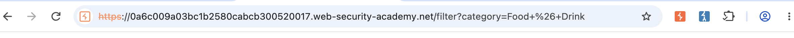
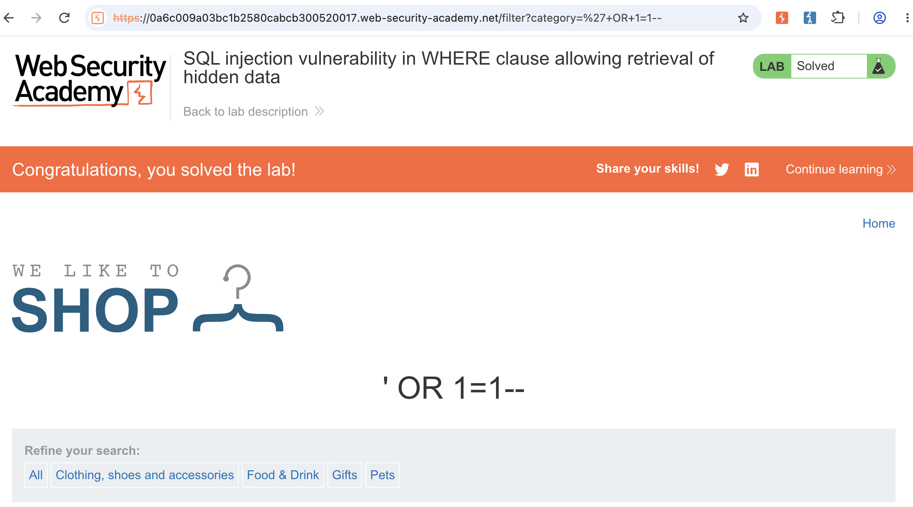

# 💉 SQL Injection in WHERE Clause — Hidden Data Retrieval


## 📌 Overview

This project documents a web security lab demonstrating a **SQL Injection vulnerability in a WHERE clause** that allows an attacker to modify the application's database query and retrieve data that was not intended to be displayed.

The lab demonstrates the process of identifying the application's search functionality, locating the parameter affected by user input, testing the parameter for SQL injection, and verifying that the injection changes the application's query behavior.

---

## 🎯 Lab Objective

The objective of this lab was to:

* Understand how SQL injection can occur in a `WHERE` clause.
* Identify a parameter that interacts with a database query.
* Test how the application handles unexpected SQL syntax.
* Determine whether the application's query logic can be modified.
* Demonstrate retrieval of hidden data.
* Understand the security impact of SQL injection.
* Document the vulnerability and its remediation.

---

## 🧪 Vulnerability

**Vulnerability:** SQL Injection

**Injection Location:** `WHERE` clause

**Impact Demonstrated:** Retrieval of hidden data

**Attack Type:** Input manipulation

**Category:** Web Application Security

---

# 🔍 Methodology

The lab was analyzed using the following process:

```text
Understand Application
        ↓
Identify Search Functionality
        ↓
Identify User-Controlled Parameter
        ↓
Test Parameter
        ↓
Analyze Application Response
        ↓
Modify Query Logic
        ↓
Verify Hidden Data Retrieval
        ↓
Document Remediation
```

---

# 1️⃣ Lab Overview

The first step was to review the lab information and understand the objective of the exercise.



The lab focuses on a SQL injection vulnerability occurring within a database query's `WHERE` clause.

---

# 2️⃣ Identifying the Search Functionality

The application's search functionality was examined to understand how user input was being processed.



The search parameter was identified as an area where user-controlled input was being passed to the application.

This provided a potential location for testing SQL injection.

---

# 3️⃣ Testing the SQL Injection Point

The request was modified through the URL to test whether the application's SQL query could be influenced by user-supplied input.



The testing demonstrated that the parameter could affect the behavior of the underlying database query.

The key observation was that the application's input was being incorporated into the query without sufficient protection against SQL syntax manipulation.

---

# 4️⃣ Successful SQL Injection

A SQL injection payload was used to alter the logic of the `WHERE` condition:

```text
' OR 1=1 --
```



The modified condition evaluates as true, causing the application's query logic to return records that would normally be excluded by the original search condition.

This confirmed that the application was vulnerable to SQL injection in the affected parameter.

---

# 🧠 How the Injection Works

A simplified vulnerable query can be represented as:

```sql
SELECT *
FROM products
WHERE category = 'USER_INPUT'
AND released = 1;
```

If user input is inserted directly into the SQL statement, an attacker may attempt to modify the logical condition.

The important concept demonstrated by this lab is that **untrusted input is being interpreted as SQL syntax rather than being treated strictly as data**.

The `OR 1=1` condition evaluates to true.

The `--` sequence is used to comment out the remaining portion of the SQL statement in database systems that support this comment syntax.

> The exact behavior of SQL comments and syntax can vary depending on the database engine.

---

# 💥 Security Impact

SQL injection can have serious consequences depending on the application's database permissions and architecture.

Potential consequences can include:

* Retrieval of data that should not be accessible.
* Bypassing application-level filtering.
* Modification of database records.
* Deletion of database records.
* Authentication bypass in some vulnerable implementations.
* Exposure of sensitive application information.

In this lab, the demonstrated impact was **retrieval of hidden data**.

The actual impact of a SQL injection vulnerability in a real application depends on the database account privileges, application architecture, accessible tables, and implemented security controls.

---

# 🧠 Root Cause

The underlying issue is the unsafe handling of user-controlled input when constructing a database query.

When application input is concatenated directly into SQL statements, specially crafted input may be interpreted as part of the SQL query.

This creates a separation problem:

```text
Expected:

User Input → Data


Vulnerable:

User Input → SQL Syntax + Data
```

The application should ensure that user-controlled values are treated as **data**, not executable SQL syntax.

---

# 🛠️ Remediation

## 1. Use Parameterized Queries

The primary defense against SQL injection is the use of **parameterized queries / prepared statements**.

For example:

```python
cursor.execute(
    "SELECT * FROM products WHERE category = ?",
    (category,)
)
```

The exact syntax depends on the programming language and database driver.

---

## 2. Avoid String Concatenation

Do not construct SQL queries by directly concatenating user-controlled input.

Avoid patterns such as:

```python
query = "SELECT * FROM products WHERE category = '" + category + "'"
```

Instead, use the parameterization features provided by the database library.

---

## 3. Apply Least Privilege

The application's database account should have only the permissions required for its functionality.

This limits the potential impact if an SQL injection vulnerability is discovered.

---

## 4. Validate Input

Input validation can provide an additional layer of protection.

However, validation should not replace parameterized queries.

---

## 5. Error Handling

Applications should avoid exposing detailed database errors to end users.

Detailed database errors can reveal information about:

* Database technology
* Query structure
* Table names
* Column names
* Application internals

---

# ✅ Verification

The vulnerability was successfully demonstrated in the authorized lab environment.

The final test showed that modifying the vulnerable parameter altered the query behavior and allowed hidden records to be retrieved.


---

# 📸 Screenshots

All screenshots used for this project are stored in the [`screenshots`](screenshots/) directory.

| #  | Screenshot               | Purpose                                          |
| -- | ------------------------ | ------------------------------------------------ |
| 01 | Lab Overview             | Introduces the lab and vulnerability             |
| 02 | Search Functionality     | Shows the application's search functionality     |
| 03 | SQL Injection Testing    | Shows modification of the affected URL parameter |
| 04 | Successful SQL Injection | Demonstrates retrieval of hidden data            |

---

# 📚 What I Learned

This lab helped me understand:

* How SQL injection occurs.
* What a `WHERE` clause does.
* How user-controlled parameters can affect database queries.
* How to identify a potential SQL injection point.
* How boolean SQL conditions can change query behavior.
* How SQL comments can affect the remainder of a query.
* Why parameterized queries are important.
* The difference between treating input as data and interpreting it as SQL syntax.
* How to document a web application security finding.
* How to describe impact and remediation.

---

# ⚠️ Disclaimer

This project was performed in an authorized laboratory environment for educational and security-testing purposes only.

Do not test SQL injection techniques against systems, applications, or accounts without explicit authorization.

---

## 👨‍💻 Project Type

**Web Application Security Lab**

### Focus Areas

* SQL Injection
* Web Application Security
* Input Validation
* Database Security
* Vulnerability Analysis
* Security Testing
* Remediation
* Penetration Testing Documentation
